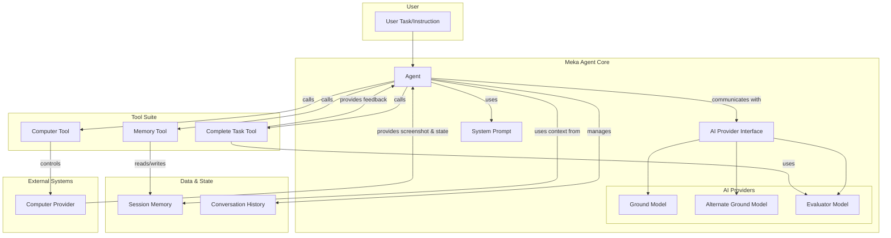

# Mixture of Models: SOTA Performance on webarena

## Abstract

Autonomous agents can automate repetitive digital tasks. This paper introduces Meka, an open-source framework for building and benchmarking such agents. Meka's architecture uses a multi-provider LLM strategy, a flexible tool system, and mechanisms for in-context learning and self-correction. On the WebArena benchmark, Meka achieves state-of-the-art (SOTA) performance beating out OpenAI Agent. This result supports the effectiveness of a multi-model strategy, where different LLMs are selected for different sub-tasks.

## 1. Introduction

Automating complex web-based tasks is a significant challenge. Meka is an open-source framework designed to build autonomous agents for this purpose. We provide a complete blueprint for creating competitive agents. Our goal is to offer a robust, transparent foundation for developers and researchers to build upon.

This paper details our work. We will cover:

- **Meka's Architecture**: A design based on four key principles: a multi-provider LLM strategy, contextual replay, memory, and reflexion.
- **Evaluation**: Our methodology for benchmarking on WebArena.
- **Impact**: Meka's performance and its place in the current agent landscape.

## 2. Meka's Architecture

Meka’s design is modular and powerful. An LLM acts as the agent's brain. It directs a set of tools to interact with a web browser.



### 2.1. Multi-Provider LLM Strategy

Our multi-provider strategy is inspired by the "Mixture-of-Agents" (MoA) methodology [1], which demonstrates that LLMs can improve their performance by collaborating. While the full MoA approach involves multiple layers of agents, we implement a simplified version where two models engage in a dialogue.

In Meka, two **Ground Models** take turns generating responses. The output from one model serves as part of the input for the next, creating an iterative refinement process. The first model might propose an action, and the second model can then look at the action along with the output and build on it.

This turn-based collaboration allows the models to build on each other's strengths and correct potential errors. It creates a dynamic, self-improving loop that leads to more robust and effective task execution. This approach harnesses the collective intelligence of both models to achieve better results than a single model could alone.

### 2.2. Contextual Experience Replay and memory

Agents must learn from their actions. Meka uses a form of in-context learning that combines short-term and long-term memory.

**Short-Term Memory:** The agent has a 7-step lookback period. Before interacting with the computer, it is forced to output its current plan and its intended next step. This process, which we call **Contextual Experience Replay**, gives the agent a robust short-term memory, allowing it to see its recent actions and outcomes and adjust its strategy on the fly. [2]

**Long-Term Memory:** For the entire duration of a task, the agent has access to a key-value store. It can use CRUD (Create, Read, Update, Delete) operations to manage this data. This gives the agent a persistent memory that is independent of the number of steps taken, allowing it to recall information and context over longer, more complex tasks.

### 2.3. Reflexion: Self-Correction

Agents need to learn from mistakes. Meka uses a **Reflexion**-style mechanism to self-correct. When the agent thinks its done, an `evaluator` model assesses the agent's progress. If the agent fails, the evaluator's feedback is added to the agent's context. The agent is then directed to address the feedback before trying to complete the task again. [3]

## 3. Use Case: An Admin Task with Self-Correction (Task #41)

To illustrate how Meka works, we can walk through a task from the WebArena benchmark (Task #41). This example demonstrates Meka's ability to navigate a complex admin interface and, its capacity for self-correction.

**Goal:** List the top 1 search terms in the store.

### Step 1: Logging In

Meka starts on the admin login page for a shopping site. It needs to authenticate to access the dashboard.

**Meka's Thought Process:**
> I need to log in to access the admin panel. I will enter the username and password and click sign in.

**Action:** Meka uses the `computer_action` tool to type "admin" and "admin1234" into the respective fields and clicks the "Sign in" button.

### Step 2: Navigating to Search Terms

Once logged in, Meka is on the main dashboard. It needs to find the search analytics.

**Meka's Thought Process:**
> I need to find search terms. This is likely under 'Marketing'. I will click the 'Marketing' menu, then find and click on 'Search Terms'.

**Action:** Meka clicks on the "Marketing" icon in the sidebar, and then clicks on the "Search Terms" link from the expanded menu.

### Step 3: Initial Sort and Misinterpretation

Meka arrives at the "Search Terms" page, which displays a table of terms and their usage statistics.

**Meka's Thought Process:**
> To find the top search term, I need to sort by the 'Uses' column. I will click the header to sort it.

**Action:** Meka clicks on the "Uses" column header. The table sorts the data in *ascending* order, showing the least-used terms first.

**Meka's Mistake:** The agent misinterprets the result. It sees the table is sorted, reads the term at the top (which is actually the *least* popular), and concludes the task is finished. It calls the `complete_task` tool with an incorrect answer.

### Step 4: Reflexion and Self-Correction

This is where the `evaluator` model intervenes. It assesses the agent's work and provides corrective feedback.

**Evaluator Feedback:**
> "The agent successfully navigated to the Search Terms page and attempted to sort by 'Uses'. However, the sort was performed in ascending order... To correctly identify the top search term, the 'Uses' column should be sorted in descending order."

**Meka's Corrected Thought Process:**
> I made a mistake. The feedback says I sorted incorrectly. I need to click the 'Uses' column again to sort in descending order. Then I can identify the top search term.

**Action:** Armed with this feedback, Meka uses the `computer_action` tool to click the "Uses" column header a second time.

### Step 5: Identifying the Correct Answer

The table now correctly sorts in descending order, with the most-used term at the top.

**Meka's Thought Process:**
> The table is now sorted by 'Uses' in descending order. The top term is 'hollister' with 19 uses. I will now complete the task with this answer.

**Action:** Meka calls `complete_task` with the final, correct answer: `Top search term: "hollister" (19 uses)`.

This walkthrough highlights not only the agent's planning capabilities but also the critical role of the **Reflexion** loop in achieving robust performance.

## 4. Benchmarking on WebArena

To validate Meka's performance, we tested it on the WebArena benchmark. We plan to open source the full eval code as well at some point.

### 4.1. Benchmark Setup and Modifications

To ensure the accuracy of our results, we made several modifications to the WebArena test suite. These changes addressed issues in the benchmark's original configuration. We did not modify any of the prompts from the original test.

- **Typos:** We corrected a typo in the `gitlab_get_project_member_role` function.
- **URL Mismatches:** We updated the start URL for the `shopping_admin` tasks in [webarena.json](./src/lib/webarena.json) to start from `http://3.149.163.222:7780/admin` instead of `http://3.149.163.222:7780`.
- **Data Correction:** We fixed incorrect numbers and values in certain tests to align with the data on the test websites. (e.g. task id 66, 293-297).
- **Exclusions:** We excluded all map-related tests. The map tiling URL in the provided Docker container was broken, making these tasks impossible to complete. Further, we excluded tasks where the expected_answer were incorrect or the tasks were impossible to complete because of the environment. You can find the list of exclusions here[TODO data file].

These resulted in a total of 684 total tasks. The full list of task along with all of its corrections can be found in [webarena.json](./src/lib/webarena.json)

We ran the evaluations in a [Scrapybara browser](https://docs.scrapybara.com/browser) instead of Playwright browsers. The models used relies on the visual action space for navigation (e.g., using the search bar or backward/forward buttons). The model interacts with the browser through computer vision and simulated mouse/keyboard actions provided by Scrapybara. This setup provides a more realistic test of the agent's ability to operate in a standard browser environment.

The actual environment in which the test is run is as suggested by the the WebArena team. The setup instruction can be found on [their GitHub](https://github.com/web-arena-x/webarena/blob/main/environment_docker/README.md).

### 4.2 Evaluation

We use a hybrid evaluation system. A task is a "PASS" only if it passes all checks.

- **program_html**: This follows a port of what [webArena has](https://github.com/web-arena-x/webarena/blob/main/evaluation_harness/evaluators.py#L356) ported from python to typescript.
- **LLM Check**: For others, we use an LLM to judge the result. It gets the task, the agent's answer, and the expected outcome. It returns a "PASS" or "FAIL" along with its reasoning.
- **Manual Review**: We manually reviewed every response where the LLM evaluator marked a result as FAIL to double check for errors. We corrected [ ] false "FAIL" where the answer matched the expected answer, but did not follow the strict format. For example, expected: "January 20th, 2024" vs. actual "01/20/2024" would be flipped from "FAIL" to "PASS". In addition, because we did not modify the prompts for tests, URL matching almost always failed as the agent does not naturally return URLs, but text. Therefore, we manually reveiwed the last page of the agent's navigation URL and matched it against the expected answer in the eval results. You can see a full list of the over-ridden eval results in this file [TODO LINK FILE].

...

## 5. Related Work

The field of autonomous agents is growing rapidly. Meka builds on the work of many others.

- **Foundations**: Our work is inspired by academic research. Papers on ReAct, Reflexion, and Contextual Experience Replay were foundational.
- **Commercial Agents**: Many companies are building powerful agents. [OpenAI's ChatGPT agents](https://openai.com/index/introducing-chatgpt-agent/), [Browser Use](https://browser-use.com/),  [Magnitude](https://magnitude.run/), and [Manus](https://manus.im/app), are all key players.
- **Our Niche**: Meka’s main contribution is our open-source nature. We provide a transparent framework. We welcome the community to inspect, learn from, and build upon our work.

## 6. Future Work and Limitations

Our work has limitations and opens areas for future research.

- **Smarter Prompts**: Our current system prompt is simple. We will explore more advanced prompting techniques to improve performance.
- **Open-Source Models**: Our framework is open. The models we use are not. We want to test how Meka performs with open-source models.
- **Better Memory**: We plan to build more advanced memory systems. This will help the agent remember information across multiple sessions on the same site.
- **More Tools**: We will continue to expand Meka's toolset based on the use cases by the community. For example, data extraction could be done via the clipboard instead of visually through the screenshot.

## 7. Conclusion

In this paper, we introduced Meka, an open-source framework for building autonomous web agents. We detailed its modular architecture, which leverages a multi-model strategy, in-context learning, and a composable tool system. We also outlined our rigorous, hybrid evaluation methodology on the WebArena benchmark, noting the specific modifications we made to ensure a fair assessment.

Meka's state-of-the-art performance demonstrates the effectiveness of this architecture. By providing a complete, open-source blueprint, we aim to empower the community to build upon our work. The Meka framework is a robust foundation for the next generation of autonomous agents. We encourage researchers and developers to use it, extend it, and push the boundaries of what is possible in web automation.

## 8. References

[1] Wang, J., Wang, J., Athiwaratkun, B., Zhang, C., & Zou, J. (2024). *Mixture-of-Agents Enhances Large Language Model Capabilities*. arXiv preprint arXiv:2406.04692.

[2] Liu, Y., Si, C., Narasimhan, K., & Yao, S. (2025). *Contextual Experience Replay for Self-Improvement of Language Agents*. arXiv preprint arXiv:2506.06698.

[3] Pan, J., Zhang, Y., Tomlin, N., Zhou, Y., Levine, S., & Suhr, A. (2024). *Autonomous Evaluation and Refinement of Digital Agents*. arXiv preprint arXiv:2404.06474.

## Appendix

To run this result site locally, follow these steps:

1. **Install dependencies:**

    ```bash
    pnpm install
    ```

2. **Run the development server:**

    ```bash
    pnpm run dev
    ```

    The site will be available at [http://localhost:3000](http://localhost:3000).
